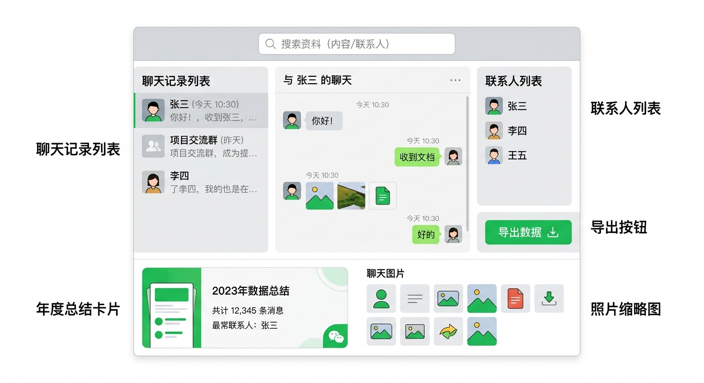
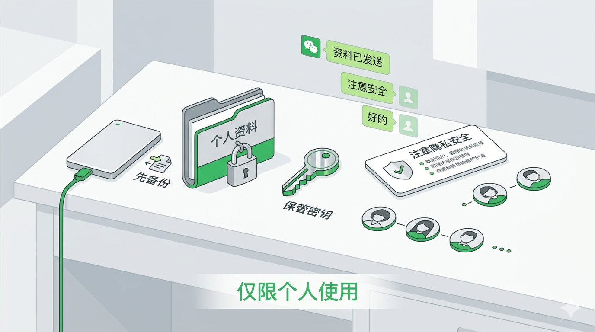
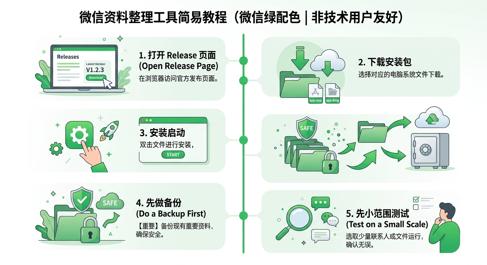

# 微信上那么多聊天记录，终于有人认真在做“整理工具”了

> 平台：微信公众号 | 字数：约2100字 | 适读人群：不懂技术、但想整理自己微信资料的人

很多人都有过这种时刻。

想找一条几年前的微信消息。 
想翻一张当时发过的照片。 
想回头看看某个人、某一年、某段关系，自己到底经历了什么。

可真到了要找的时候，你会发现，微信其实不是一个很适合“长期整理资料”的地方。

它适合聊天。 
不太适合归档。

所以这些年，网上一直有人做“微信数据工具”。 
但我看下来，很多项目都有一个共同问题：

**技术上很强，普通人却很难真正用起来。**

而我最近看到的这个开源项目 [WeChatDataAnalysis](https://github.com/LifeArchiveProject/WeChatDataAnalysis)，让我停下来认真看了一会儿。

不是因为它名字听起来多硬核。 
而是因为它开始认真解决一个更实际的问题：

**如果普通人只是想把自己的微信资料整理出来，有没有一套更像样的办法？**

---

## 它到底能帮你做什么

先别管那些技术词。

你可以把它理解成一个**“微信资料整理工具”**。

按它公开写出来的功能，它大概能做这些事：

- 回看聊天记录
- 搜索聊天内容
- 导出聊天记录和联系人
- 查看部分朋友圈内容
- 生成年度总结

如果你只看这几项，可能会觉得也没什么特别。

但真正的区别在于，很多项目只是把数据“拿出来”，然后就没下文了。  
而这个项目明显想再往前走一步：把这些资料做成一个人能打开、能浏览、能搜索、能回顾的界面。

> 这部分最值得记住的一句
> **很多工具只能把数据拿出来，WeChatDataAnalysis 想做的是让普通人用起来。**

因为“拿出来”和“用起来”中间，隔着很远。

---

## 为什么这件事对普通人有意义

对大多数人来说，微信里装的根本不只是聊天。

里面有工作往来，有家庭对话，有旧照片，有转账记录，有语音，也有很多你平时不会想起、但某天突然特别想找回来的片段。

平时你不会天天翻。 
可一旦真要找，它们就会变得很重要。

问题是，微信原生更像一个当下交流工具。

今天发一句，今天回一句，它很好用。 
但如果把时间拉长到三年、五年、八年，它就不那么像一个方便整理资料的地方了。

这也是为什么，普通人其实也会对这类项目感兴趣。

他们未必想研究技术。 
他们只是想把自己的资料**留得更清楚一点、找得更方便一点**。

> 重点不在“技术有多强”
> 重点在于：**你的聊天记录、照片、联系人，到底能不能被重新整理成自己的资料。**

---

## 这个项目让我觉得不一样的地方

说白了，很多同类项目更像“实验成果”。

你能看出来作者很厉害，技术也确实过硬。 
但普通人面对它的时候，常常还是会问一句：

**然后呢？**

然后我拿到这些东西，怎么找？ 
怎么翻？ 
怎么保存？ 
怎么确认自己没有把重要资料搞乱？

`WeChatDataAnalysis` 给我的感觉，是它开始认真补“然后呢”这一段了。

它不只是想证明“这件事能做”，而是开始考虑：

- 普通人能不能点开就看
- 能不能像平时用微信那样比较顺手
- 能不能搜到以前的记录
- 能不能把想保留的内容导出来
- 能不能把零散的聊天变成自己的资料

这听起来不算炫。 
但它反而更难。

因为真正把一个工具做得有人愿意长期用，靠的不是一句“我能做到”，而是很多细节都得顺。

> **它不像“演示技术”的项目，更像“认真做工具”的项目。**

---

## 它值不值得试？先说结论

我觉得，值得关注。

但它适合的是一类比较明确的人，不是所有人。

> 适不适合你，先看这里
> **适合想整理自己微信资料的人。**
> **不适合完全不想折腾、也没有备份习惯的人。**

更适合它的人，大概是这些：

- 想整理自己微信资料的人
- 经常要回查聊天记录的人
- 想做个人备份的人
- 想回顾过去几年聊天、照片、朋友圈的人

不太适合的人，也很明确：

- 完全不想折腾的人
- 对电脑文件完全没有概念的人
- 没有备份习惯的人
- 想碰别人数据的人

后面这一点必须讲清楚。

这类工具碰的都是很私人的内容。  
聊天、联系人、照片、朋友圈，本质上都是你的隐私资料。

> **只处理你自己的数据。**
> **不要碰别人的聊天记录。**

---

## 如果你是小白，最该关心的不是“原理”

如果你不懂技术，其实完全没必要先研究它背后的原理。

你更该关心的是**下面三件事**。

### 1. 它有没有给普通人留入口

这一点，它做得还可以。

截至 2026 年 4 月 2 日，我核对到它在 GitHub Releases 页面上的最新版本是 `v1.6.22`，发布时间是 `2026-03-17`。README 里也写了 Windows 安装包路线。

这说明作者至少不是只想让程序员自己折腾。

### 2. 整理出来以后，你能不能看懂

从它公开展示的界面和说明来看，它明显在努力往“看得懂、用得上”靠。

它不是把一堆表格扔给你，而是尽量做成聊天记录页面、搜索页面、导出页面、年度总结页面这种普通人更容易理解的样子。

这一点非常重要。

因为数据能拿出来，和数据能被人看懂，差别真的很大。

### 3. 它会不会有风险

你要明白，它处理的是你的私人资料。

所以真正该紧张的，不是“它酷不酷”，而是：

- 你的数据是不是自己的
- 你有没有先做备份
- 你的密钥有没有保管好
- 你的导出文件有没有乱传

如果这些习惯没有，工具再好也不稳。

> 小白真正要盯住的重点
> 1. **有没有安装入口**
> 2. **界面是不是看得懂**
> 3. **自己有没有先备份**

---

## 小白如果真想试，最稳的方式是什么

如果你真想上手，别一开始就想着研究源码、配环境、把所有历史一次导出来。

对小白来说，最稳的路线只有一条：

**先用 Windows 安装版，先试最小闭环。**

README 给出的路径很简单：

1. 打开项目的 Release 页面
2. 下载 `WeChatDataAnalysis.Setup.<version>.exe`
3. 安装后启动

第一次试，你只需要先验证三件事：

1. 能不能正常安装
2. 能不能打开界面
3. 能不能先用一份你自己可控的数据副本做测试

这里特别建议你记住“副本”两个字。

第一次不要拿自己唯一的一份重要数据直接上。  
先备份，再测试。  
能跑通了，再慢慢加内容。

这比一上来就折腾一大堆设置，靠谱得多。

> 最稳的上手顺序
> 1. **下载安装版**
> 2. **先拿副本测试**
> 3. **确认能看、能搜、能打开**
> 4. **最后再决定要不要继续整理**

---

## 还有一个现实问题：它不是一键魔法

这点也要提前说。

这个项目虽然已经比很多同类工具更像“给人用的工具”了，但它依然不是“装完就自动帮你搞定一切”的神奇软件。

它在使用前仍然需要先获取微信数据库的解密密钥，仓库里推荐配合 `wx_key` 这类工具使用。

你可以把它理解成：

它已经把“整理资料”这件事做得更像样了，  
但前面的准备工作，还没有完全消失。

所以如果你是完全不懂电脑、也没人能帮你一把的那种小白，你大概率会卡在前面。  
但如果你是“会安装软件、会做备份、愿意按步骤试”的小白，那它就有尝试价值。

> **它已经比很多同类工具更适合普通人，但它还不是“点一下全自动”的傻瓜软件。**

---

## 最后一句话

如果你只是想围观，这个项目值得收藏。 
如果你真的想整理自己的微信资料，它也值得留意。

但动手之前，请先记住这个顺序：

**先确认是你自己的数据。** 
**先做备份。** 
**先保管好密钥。** 
**先小范围测试。** 
**最后再慢慢整理。**

很多时候，一个工具真正打动人的地方，不是它多厉害，而是它有没有替普通人把路铺平一点。

`WeChatDataAnalysis` 现在让我愿意多看一眼，正是因为它开始做这件事了。

你会想整理自己的微信聊天记录吗？ 
如果会，你最想找回的是哪一类内容：某个人、某一年，还是某段已经快记不清的生活？

---

