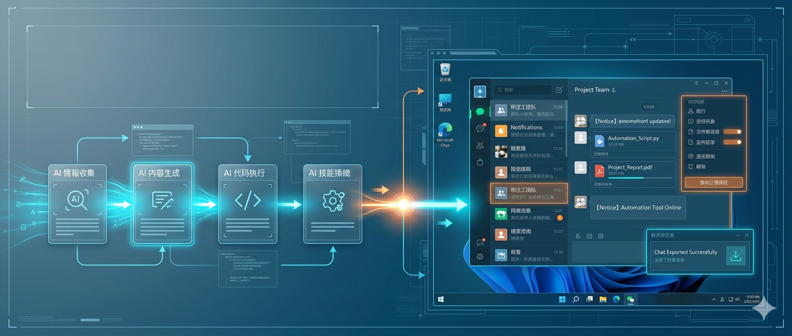
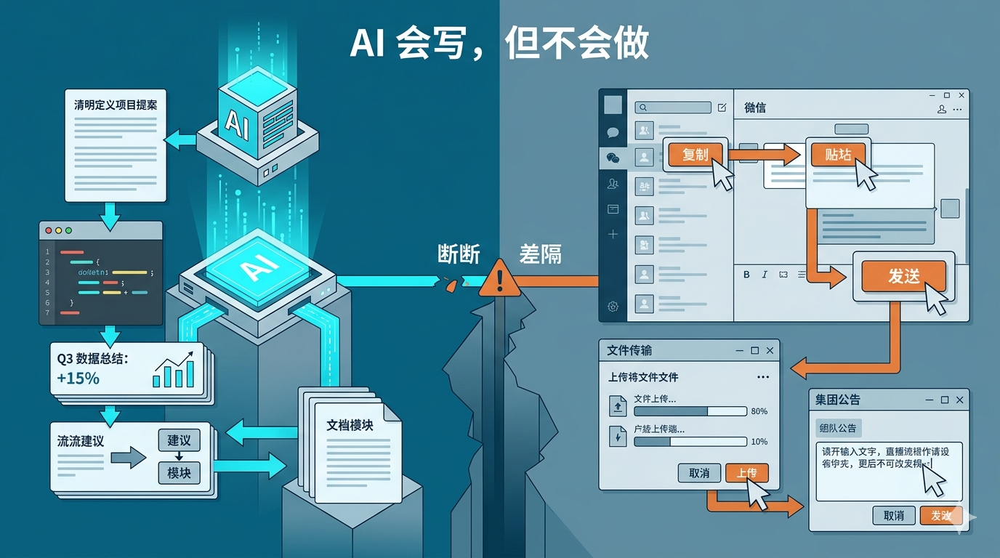
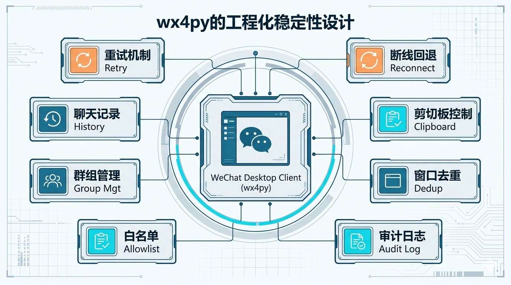
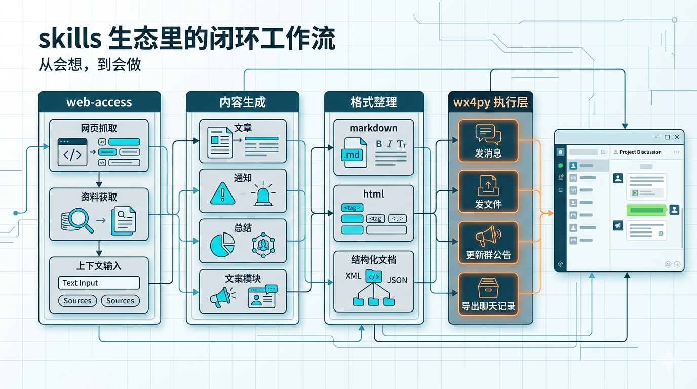

# AI 会写不会做？这个项目，正在补上微信自动化的最后一公里

> 平台：微信公众号 | 字数：约2900字 | 调性：理性、直接、带使用经验感



---

这两年大家一直在谈 AI agent。

会搜索，会总结，会写方案，会生成代码，看起来什么都会。

可一到真正干活的环节，问题马上就冒出来了。它能写出“给 3 个微信群发通知”的代码，却不会真的把通知发出去；它能整理出群聊复盘，却停在“聊天记录怎么导出来”；它甚至能把公告写好，最后还是要你自己复制进微信。

我越来越觉得，很多 AI 现在卡住的地方，不在分析，也不在生成，而在执行。



我最近认真看了 GitHub 上的 `claw-codes/wx4py`，最大的感受很明确：这个项目真正有价值的地方，不只是“微信自动化”这四个字，而是它把 AI 落地里最麻烦、也最容易被跳过的一层补上了。

## 1. 为什么大多数 AI workflow，最后都死在微信这一步？

因为真实工作流从来不是“内容生成完了”就结束。

通知要发到群里，文件要分发到不同部门，群公告要统一更新，聊天记录要导出来做统计。很多人日常最耗时间的，其实就是这些重复动作。问题在于，微信并没有给普通用户一个顺手、稳定、低门槛的自动化入口。

所以很多所谓的 AI 自动化，最后都会卡在一句很扫兴的话上：下面这一步，请你手动操作。

这就是最后一公里，也是最折腾人的一公里。

## 2. wx4py 做对的第一件事：它不是在卖炫技，而是在卖动作

很多自动化项目看起来很强，真用起来却不顺手。原因通常也不复杂：它们暴露给你的，是控件、坐标、句柄和树结构；但你真正关心的，通常是下面这些事：

- 怎么给群发消息
- 怎么批量发文件
- 怎么拿聊天记录
- 怎么改群公告
- 怎么设免打扰
- 怎么把这件事交给 AI 去调度

`wx4py` 这一点做得比较克制。它没有逼你从 UI Automation 的细节开始拼，而是直接把常见动作包成接口：

- `send_to`
- `batch_send`
- `send_file_to`
- `get_chat_history`
- `get_group_members`
- `modify_announcement_simple`
- `set_group_nickname`
- `set_do_not_disturb`
- `set_pin_chat`

这件事很重要。一个项目如果是按“动作”来抽象，而不是按“控件”来抽象，它才更有机会进入真实工作流。控件只是实现细节，动作才是能反复复用的部分。

## 3. 更重要的是，它没有假装“自动化天然稳定”

真正做过桌面自动化的人都知道，最难的从来不是“第一次跑通”，而是第 37 次还能跑通。

这也是我看 `wx4py` 源码时最在意的部分。

它做了不少不性感、但非常重要的事：

- 连接微信前检查 Windows 可访问性相关注册表
- 必要时重启微信，避免 UIA 会话不稳定
- 给发送流程加重试和重连兜底
- 对批量发送加入随机抖动，降低机械行为风险
- 用剪贴板粘贴统一文本输入，减少输入法和控件焦点问题
- 对短时间重复发送做去重抑制
- 把发送审计日志单独落盘
- 用允许群白名单限制误发范围



这些设计放在一起，能看出作者在意的不是“我能不能把微信点开”，而是“这东西放进真实场景以后，会不会频繁翻车”。

这和很多演示型项目的思路不一样。前者更像 demo，后者才更接近工具。

## 4. 它最聪明的一步，其实不是库，而是 skill

`wx4py` 仓库里有个很容易被忽略的目录：`wx4-skill`。

这说明它想进入的，不只是 Python 脚本世界，而是 agent / skill 的编排世界。

如果你本地已经装过一批 skills，这个感觉会很明显。大致可以把这些能力分成三层：

- `web-access` 这类：负责拿信息
- `Viral Writer`、Markdown/HTML 相关 skill：负责把信息整理成可读内容
- 发布、发送、同步类能力：负责把结果推进到现实世界

很多人以为自己缺的是更强的大模型，我现在反而觉得，很多时候真正缺的是第三层。前两层只能让 AI 会想、会写；第三层才决定事情能不能真的做完。

从这个角度看，`wx4py` 的位置就很准。它不是去和通用模型竞争，而是在给现有技能系统补执行能力。

## 5. 放到现有 skills 生态里看，它的价值会更清楚

你可以想象这样一条链路：

1. `web-access` 把资料和上下文抓回来
2. `Viral Writer` 或别的内容 skill 生成通知、总结、话术
3. Markdown / HTML skill 负责格式整理
4. `wx4py` 把消息、文件、公告真正送到微信



这么看就很清楚了，`wx4py` 补上的不是单独一个“发微信”功能，而是一个原来经常断掉的闭环。没有这一步，AI 再聪明，也经常停在“内容已经帮你写好了”；有了这一步，事情才可能继续往前走。

## 6. 别只看热闹，3 分钟先把它跑通

看到这里，很多人更关心的应该不是“这个项目值不值得关注”，而是“我到底怎么把它跑起来”。

先说前提。

`wx4py` 不是 Web API，也不是云服务。

它控制的是你本机上的微信 PC 客户端。

所以运行条件很明确：

- Windows 10/11
- Python 3.9+
- 微信 PC 端 4.x
- README 标注已测试版本：`4.1.7.59`、`4.1.8.29`
- 微信要先登录，而且操作时尽量保持前台

如果这些条件都满足，第一步很简单：

```bash
pip install wx4py
```

然后用最小示例先测通，不要上来就群发。

先拿“文件传输助手”做回环测试：

```python
from wx4py import WeChatClient

with WeChatClient() as wx:
    wx.chat_window.send_to("文件传输助手", "wx4py 连接成功！")
```

如果这条消息能自动发出去，说明你的环境、微信窗口识别、基础输入链路都已经通了。

这一步很重要。桌面自动化最忌讳的，就是基础链路还没验证，就直接拿真实群和真实账号做批量操作。

我的建议很简单：先跑通“文件传输助手”，再碰真实工作群。这是最低成本、也最稳的测试方式。

## 7. 真正常用的，不外乎这 4 个动作

### 1. 批量群发通知

这基本就是最常见的场景，比如通知多个项目群、部门群、日报群：

```python
from wx4py import WeChatClient

with WeChatClient() as wx:
    wx.chat_window.batch_send(
        ["技术部", "产品部", "运营部"],
        "【通知】明天下午 3 点开会",
        target_type="group"
    )
```

这类动作的价值，不只是省几次点击，而是把重复动作真正沉淀成脚本资产。

### 2. 批量发文件

如果你经常把同一份 PDF、周报或者表格发到多个群，这个功能会很直接：

```python
from wx4py import WeChatClient

with WeChatClient() as wx:
    wx.chat_window.send_file_to(
        "技术部",
        r"C:\周报\weekly.pdf",
        target_type="group"
    )
```

你也可以在自己的脚本里循环多个群名，实现文件分发。

### 3. 导出聊天记录

如果你的需求不是“发”，而是“拿”，那最值得试的就是聊天记录导出：

```python
from wx4py import WeChatClient

with WeChatClient() as wx:
    messages = wx.chat_window.get_chat_history(
        "项目讨论组",
        target_type="group",
        since="week"
    )

    for msg in messages[:5]:
        print(msg)
```

`since` 支持的典型范围包括：

- `today`
- `yesterday`
- `week`
- `all`

这一点很适合接后续分析工作流，比如转 CSV、JSON、Excel，或者再接总结脚本、内容生成类 skill。

### 4. 管群，不只是发消息

`wx4py` 不只是消息发送器，它还覆盖了一部分高频群管理动作，比如：

- 改群公告
- 设置群昵称
- 开关免打扰
- 置顶聊天
- 拉取群成员列表

比如改群公告：

```python
from wx4py import WeChatClient

with WeChatClient() as wx:
    wx.group_manager.modify_announcement_simple(
        "项目群A",
        "本周重点：完成用户模块开发"
    )
```

如果你本来就有 Markdown 文档，还可以用它的 Markdown 公告方式，把格式化内容直接贴进群公告。

## 8. 如果你不想写脚本，可以直接让 AI 调它

这也是这个项目最有意思的地方。仓库里已经带了 `wx4-skill`，也就是说它天然适合进 agent 工作流。

很多时候，你不一定要自己写一堆 Python，也可以直接把它交给 AI 调度。

比如在 Claude Code、Codex 或 OpenClaw 这类本地 agent 环境里，你可以让 AI 执行这种任务：

```text
帮我给工作群发消息：明天 9 点开会
```

或者：

```text
帮我获取“项目讨论组”本周聊天记录，导出成 JSON
```

再进一步一点，你甚至可以把它放进一条完整链路里：

1. `web-access` 抓资料
2. 写作类 skill 生成通知文案或总结
3. Markdown / HTML skill 整理格式
4. `wx4py` 真正把内容发到微信

到这一步，AI 就不只是“帮你写好了”，而是真的开始替你把事情往下做。

## 9. 它也有明显边界，而且这些边界必须正视

这个项目很实用，但边界也很明确，不能神化。

从 README 和源码能明确看到几个前提：

- 只支持 Windows 10/11
- 依赖微信 PC 端 4.x
- README 标注已测试版本是 `4.1.7.59` 和 `4.1.8.29`
- 运行时需要微信窗口在前台
- 聊天记录拿不到发送者姓名，这是 UIA 边界
- 批量发送依然要控制频率，不能把自动化理解成“无限量乱发”

截至 2026 年 4 月 2 日，GitHub 页面显示它有 `111` 个 Star、`36` 个 Fork，最新 release 是 `v0.1.3`，页面日期显示为 2026 年 3 月 31 日。仓库 `CHANGELOG.md` 里，`0.1.3` 的变更日期写的是 2026 年 4 月 1 日。

这至少说明两件事：一是它还在快速迭代，不是做完就扔的仓库；二是它还处在早期阶段，别把它想成已经完全打磨好的企业级平台。

另外还有个很多人容易忽略的点：授权。

仓库写的是 `AGPL-3.0`，并额外强调商业使用限制。

如果你只是自己研究，问题不大。

但如果你要把它放进公司流程、客户项目、商业产品，就别只顾着跑通，先把许可证看明白。

## 10. 我为什么觉得这个项目值得写一篇文章？

因为它踩中的不只是“微信自动化”这个题材，而是一个更大的趋势：

**AI 的竞争，正在从“谁更会生成”，转向“谁更能执行”。**

以前大家比谁更会聊天。

后来比谁更会写代码。

再后来比谁更会调用工具。

接下来真正拉开差距的，是谁能把结果稳定推进到业务现场。

公众号发布是一种执行。

IM 桥接是一种执行。

桌面应用自动化也是一种执行。

而微信，恰恰又是中国很多真实工作流里绕不过去的一层。

所以 `wx4py` 的价值，不在于它是不是最大的项目，而在于它卡在一个很关键的位置：它把“AI 生成完了”往前推了一步，推到“AI 能不能把微信这一步也做掉”。

## 结语

如果你只把 `wx4py` 当成一个微信群发工具，很容易低估它。放到整个 skills 生态里看，它补上的其实是一块大家都知道重要、但一直不太好补的能力：把生成结果继续推进到真实动作里。

很多人总觉得 AI 落地难，是模型还不够强。我现在更倾向于另一种判断：模型已经够强了，缺的是把它接到现实动作上的那条线。`wx4py` 做的，就是把这条线往前接一截。

---

你现在最想让 AI 接管的“最后一公里”是什么？

是微信群发、文件分发、聊天记录沉淀，还是某个你每天都在重复点击的桌面软件？

评论区聊聊。


